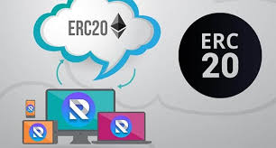

# ERC20bounty

A Simple ERC-20 Token Transfer Example with Hashing Contract Storage and ERC-721 Unique Token Launch

ERC-20 and ERC-721 tokens both very popular these days among the launches of ICO's and the more recent fascination with marketplaces such as cryptokitties. The ERC-721 standard has gone through a couple iterations and is stabilizing rather quickly, so we are most likely going to see adoption continuing to increase in the present and future. The basic premise of these non-fungible tokens is that each token is unique and therefore cannot be exchanged on a 1:1 basis like an ERC20 token may be. There are many use cases where a unique tangible or digital asset may represented by these ERC-721 tokens and we are really starting to see this pick up for various enterprise blockchain projects

Purpose of this project
This project will create an ICO of 100,000 ERC-20 tokens using the EthPm OpenZeppelin implementation of the ERC-20 standard that can be freely exchaged from the owner to any peer of his/her coice as a bounty. There are a couple other added features included in this project, the list of actions possible are:

1. ERC-20 token bounty exchange: See web app (localhost:3000) to send tokens and view them in Metamask wallet
2. Built-in hashing utilizing smart contract storage of user input, demonstrating the fundamentals of how more complex, larger data elements are often stored/referenced on-chain
3. ERC-721 unique token creation and distribution (see smart contract and test cases for more information)

## Setup Instructions
1. Clone this repo, then cd into the Fproj folder
2. Run npm install (this will download dependancies from packages.json). Make sure that you have node, npm, truffle, ganache, and metamask installed
3. start ganache (or ganache-cli) and make sure it is set to run on port 8545
4. In a separate bash or powershell terminal, run "truffle console"
5. Run compile
6. Run migrate (this will deploy the smart contracts to the Ganache or Ropsten testnet)
7. Run test (this will run all of the contract tests)
8. In a separate bash or powershell terminal, run "npm start" to launch the web server that will run on localhost:3000

## EthPM Packages Used: OpenZeppelin
openzeppelin-solidity/contracts/token/ERC721/ERC721Token.sol...
openzeppelin-solidity\contracts\AddressUtils.sol...
openzeppelin-solidity\contracts\introspection\ERC165.sol...
openzeppelin-solidity\contracts\introspection\SupportsInterfaceWithLookup.sol...
openzeppelin-solidity\contracts\math\SafeMath.sol...
openzeppelin-solidity\contracts\token\ERC721\ERC721.sol...
openzeppelin-solidity\contracts\token\ERC721\ERC721Basic.sol...
openzeppelin-solidity\contracts\token\ERC721\ERC721BasicToken.sol...
openzeppelin-solidity\contracts\token\ERC721\ERC721Receiver.sol...
openzeppelin-solidity/contracts/lifecycle/Pausable.sol...

## Test Requirements

### EthHash Test: These tests were created to test the hashing mechanism being tapped from the UI. The test check to see a couple of things:

1. Was the input data received by the contract
2. Has the contract sucessfully hashed the data
3. Has the contract sucessfully stored the data 
4. Accounting for various inputs
5. Checking validity of hash some same input

### ERC-721 Test: These tests were created to tese the following:

1. Can I deploy and mint a unique ERC721 token?
2. Ability to uniquely create multiple tokens
3. Ability to manage ownership of tokens
4. Ability to safely transfer tokens
5. Ability to return tokens and create new tokens

## Design Pattern Requirements

1. Implementation was based around the world class smart contract library, Open Zeppelin. This library infuses industry best practices around common smart contract best practices and functions. These were utilized in the creation of the ERC-20 and ERC-721 token launches by utilizing the Open Zeppelin Token Templates that the methods and test cases pulled from.

2. An emergency stop was also implemented for the sake of best practice: Pausable from Open Zeppelin https://openzeppelin.org/api/docs/lifecycle_Pausable.html

[Design Pattern Requirements ]https://github.com/parm23/ERC20bounty/edit/master/DesignPatternRequirements.md

## Avoiding Common Attacks

[Avoiding Common Attacks ]https://github.com/parm23/ERC20bounty/edit/master/AvoidingCommonAttacks.md

## Deploying to Ropsten Network

